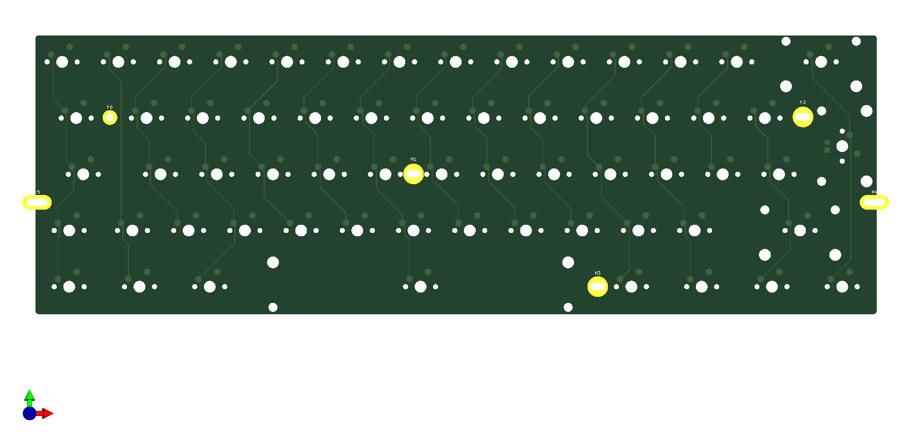

# Env-KB60
 Another Raspberry Pi Pico Keyboard but this time 60% and compact!

## This project is sort of on hold kinda.

### What Dis!?

This is another Raspberry pi Pico keyboard that ive designed, its a 60% this time around and the diodes are a bit more akin to a normal keyboard, This should support ansi and ISO.
As of right now there are no mount holes nor SVGs for Laser cut acrylic, same for there being no keymap but those arent hard to make for KMK.

to add since my income is relatively low these extra boards ive made may be slow going to make progress since getting PCBs Made and acrylic made costs money which I dont have much of (basically paying bills are more important), With that said I'll happily help if you want work on your own boards of make changes to this one.

### Goal
the goal of this keyboard is to make it GH60 case compatible and a secondary objective is ANSI support.

### Extra notes
in the schematic there are double positions for some keys just to allow for ansi support since I design natively ISO first, there is also 2 backslash keys one of which can be ignored if you use ANSI or ISO.

the rpi pico will need a spacer of some sort so you'll likely just need normal male headers and snip the extra length off once you've soldered the pico to the PCB, DO NOTE that you should do this AFTER installing the switches unless you have a way of removing the rpi pico.